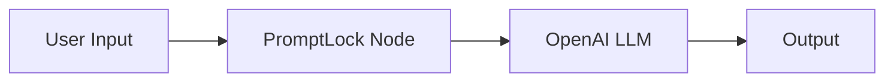

# PromptLock for Retool

Secure your Retool AI apps from prompt injection & PII leaks

---

## Overview

PromptLock is a **Retool custom component** that sanitizes user input before sending it to an LLM. It blocks injection attempts, redacts sensitive data, and returns risk scores + violation logs.

With PromptLock, you can:

* ✅ Block prompt injection attacks
* ✅ Redact PII/PHI before it reaches OpenAI
* ✅ Receive a **risk score (0–100)** per input
* ✅ Log violations for compliance (HIPAA, GDPR, PCI)

---

## Installation

1. Clone or download this repo.
2. In Retool, go to **Custom Components → Create New → Upload File**.
3. Upload `src/PromptLockAnalyze.tsx`.
4. Save and add the component to your Retool app.

---

## Usage

1. Drag **PromptLock** into your Retool canvas.
2. Enter your **PromptLock API key** in the component settings.
3. Wire it up:

   * **Input → PromptLock → LLM → Output**

Example workflow:

---

## Example App

See `examples/example-app.json` for a sample Retool app that uses PromptLock to sanitize user prompts before sending them to OpenAI.

---

## API Key

Get your free PromptLock API key → [promptlock.io/retool](https://promptlock.io/retool)

---

## License

MIT License — free to use, modify, and distribute.

---

## Contributing

Pull requests are welcome. For major changes, please open an issue first to discuss what you’d like to change.

